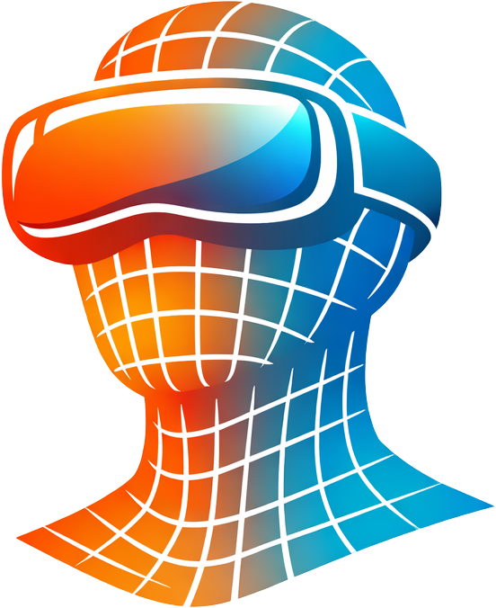
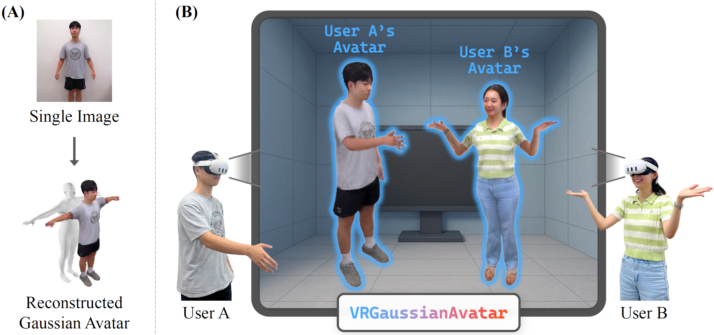
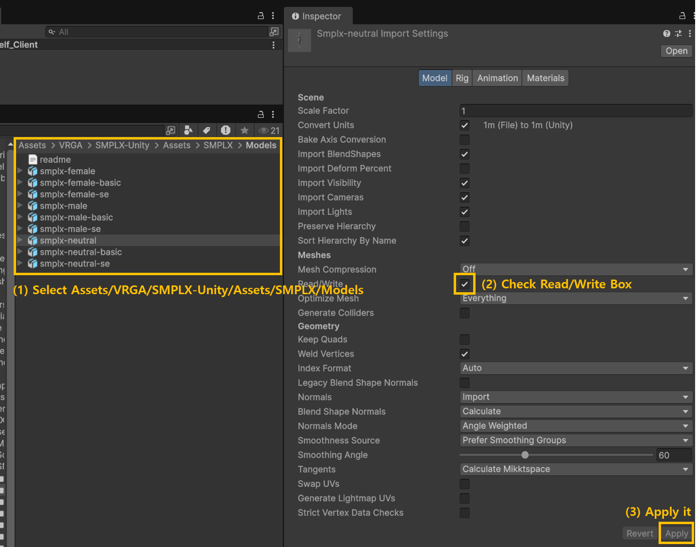

# <span> VRGaussianAvatar: Integrating 3D Gaussian Avatars into VR</span>

##### <p align="center"> [Hail Song](https://hailsong.github.io/)<sup>1</sup>, [Boram Yoon](mailto:boram.yoon1206@kaist.ac.kr)<sup>2</sup>, [Seokhwan Yang](mailto:ysshwan147@kaist.ac.kr)<sup>1</sup>, [Seoyoung Kang](mailto:sy1009kang@kaist.ac.kr)<sup>1</sup>, [Hyunjeong Kim](mailto:hcihjkim@gmail.com)<sup>3,4</sup>, [Henning Metzmacher](mailto:henning.metzmacher@inf.ethz.ch)<sup>4</sup>, [Woontack Woo](mailto:wwoo@kaist.ac.kr)<sup>1,2</sup> </p>

##### <p align="center"> <sup>1</sup>KAIST UVR Lab, <sup>2</sup>KAIST KI-ITC ARRC, <sup>3</sup>Hansung University, <sup>4</sup>ETH Zurich, Game Technology Center </p>
##### <p align="center"> IEEE VR 2026 &middot; IEEE TVCG 2026 </p>

<p align="center">
  <a href="https://vrgaussianavatar.github.io/">
    
  </a>
  <a href="https://arxiv.org/abs/2602.01674">
    
  </a>
</p>

<p align="center">
  
</p>

This repository contains an end-to-end system for driving and rendering full-body **3D Gaussian Splatting (3DGS)** avatars in VR. The system is split into:

- **GA Backend (Python)**: renders a one-shot reconstructed 3D Gaussian avatar using the streamed pose and camera/view parameters.
- **VR Frontend (Unity)**: runs in the VR runtime, obtains user motion/view signals from the HMD, and streams them to the backend. The rendered results are received back and displayed in VR.

---

## Repository Structure

```

VRGaussianAvatar/
├─ VRGaussianAvatar_GABackend/ # Python project (GA Backend)
│ ├─ experiments/
│ └─ LHM/
└─ VRGaussianAvatar_VRFrontend/ # Unity project (VR Frontend)
├─ Assets/
├─ ProjectSettings/
└─ Packages/ (Unity will manage this)

```


---

## Quick Start (Localhost)

### 0) Clone repository (Including submodules)

```bash
git clone --recurse-submodules https://github.com/hailsong/VRGaussianAvatar.git
```

### 1) GA Backend (Python)

The GA Backend is self-contained under `VRGaussianAvatar_GABackend/`.
**It is highly recommended to use the provided `install.bat` script** to set up the environment, as it handles specific versions of Torch, PyTorch3D, and other dependencies.

**Setup & Run:**
```bash
cd VRGaussianAvatar_GABackend

# 1. Create and activate virtual environment
python -m venv .venv
# Windows (PowerShell)
.venv\Scripts\Activate.ps1

# 2. Install dependencies (Windows)
# This script installs Torch 2.3.0, PyTorch3D, SAM2, etc.
# For the other depencency issues, please refer the LHM repository
# https://github.com/aigc3d/LHM
.\install.bat

# 3. Run the server
python main_server_dual.py
```

Notes:

If the backend provides additional setup docs/scripts (e.g., model downloads, environment variables, config files), use the ones inside VRGaussianAvatar_GABackend/.

Run the backend first before launching the Unity frontend.


## 2) VR Frontend (Unity)

**Unity version:** `6000.1.13f1`

### Setup
1. **Download the Main Scene**:
   - Download `C1_Self_Client.unity` from [Google Drive](https://drive.google.com/file/d/1AXPOeICSh2o5Dw1yyIZ_GMPLAp02YRh4/view?usp=drive_link).
   - Place it in: `VRGaussianAvatar_VRFrontend/Assets/VRGA/Scene/`.

2. **Download SMPLX Asset**:
   - Download `SMPL-X Unity Package` from [SMPL-X Website](https://smpl-x.is.tue.mpg.de/).
   - Place it in: `VRGaussianAvatar_VRFrontend/Assets/VRGA/Scene/SMPLX-Unity`.

3. Open **Unity Hub**.
4. Click **Open** and select the folder:
   - `VRGaussianAvatar_VRFrontend/`
5. Ensure the project is opened with **Unity `6000.1.13f1`**.
6. Open the scene `Assets/VRGA/Scene/C1_Self_Client.unity`.
7. **SMPLX Model Setting**:
   - (1) Select `Assets/VRGA/SMPLX-Unity/Assets/SMPLX/Models`
   - (2) Check "Read/Write" Box
   - (3) Click **Apply**
   

8. Run the project under the **VR Front Link setting** (Link-based PCVR execution).

---

## Typical Workflow (Localhost)

1. Start **GA Backend** on your machine (localhost).
2. Open and run **VR Frontend** in Unity using **Link mode**.
3. The frontend streams pose/view parameters to the backend.
4. The backend renders the 3D Gaussian avatar and streams frames back.
5. The frontend displays the returned rendering in VR.

---

## Citation

If you use this codebase in academic work, please cite the corresponding paper:

```bibtex

@article{song2026vrgaussianavatar,
  title={VRGaussianAvatar: Integrating 3D Gaussian Avatars into VR},
  author={Song, Hail and Yoon, Boram and Yang, Seokhwan and Kang, Seoyoung and Kim, Hyunjeong and Metzmacher, Henning and Woo, Woontack},
  journal={IEEE Transactions on Visualization and Computer Graphics},
  year={2026},
  publisher={IEEE}
}

# We use the LHM as a backend for the 3D Gaussian avatar rendering.
@inproceedings{qiu2025LHM,
  title={LHM: Large Animatable Human Reconstruction Model from a Single Image in Seconds},
  author={Lingteng Qiu and Xiaodong Gu and Peihao Li  and Qi Zuo
     and Weichao Shen and Junfei Zhang and Kejie Qiu and Weihao Yuan
     and Guanying Chen and Zilong Dong and Liefeng Bo 
    },
  booktitle={arXiv preprint arXiv:2503.10625},
  year={2025}
}

```
